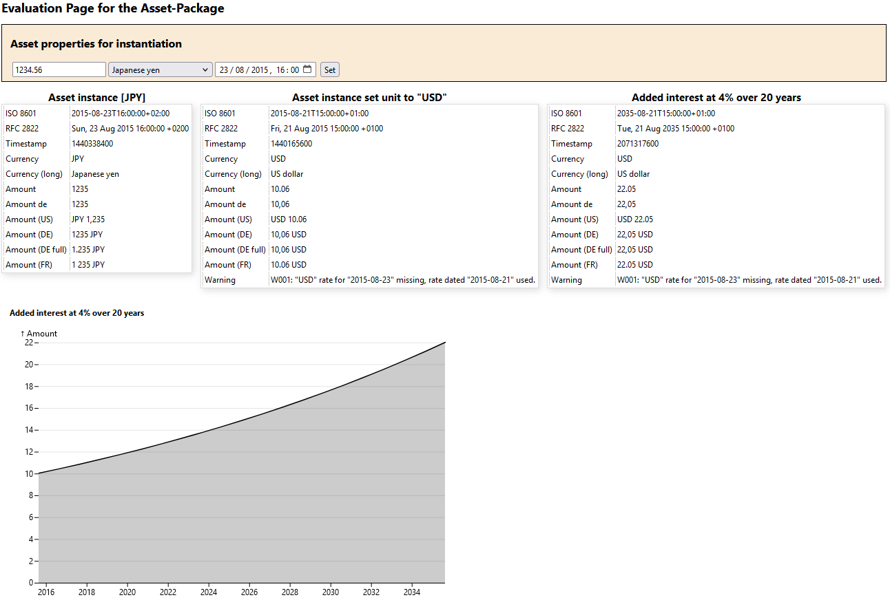

# Asset package

The asset class of this package can be used to create objects representing an asset. The main properties of such an asset are "value", "unit" and "dateTime", e.g. 1 (value) Euro (unit) at 12/03/2023. These three properties need to be provided to the contructor of a new asset object. If a different unit is set, the exchange rate is applied to the asset object and the dateTime will be updated to the excchange rate dateTime. 

>[!NOTE]
>European Central Bank exhchage rates are used. If an exchage rate is not yet present as csv-file in the data directory, it will be downloaded via the ECB API and saved to data directory. If an exchange rate is requested for a weekend (such as in the code sample below) or bank holiday, the latest valid exchange rate before that date will be used and a warning will be added as asset property.

## Code Samples

```
require_once('../php/Rates.php');
require_once('../php/Asset.php');

// asset object creation
$asset = new \SourcePot\Asset\Asset(1234.56,'JPY',new \DateTime("2015-08-23"));

// setting a new unit, converting JPY to USD @2015-08-23
$asset->setUnit("USD");

// will show 10.06 USD (2015-08-21T23:00:00+01:00), the asset dateTime was adjusted to the exchange rate dateTime
echo $asset; 
```

Method `\SourcePot\Asset\Asset::getArray()` returns an array with derived asset properties including any warnings or errors.
```
// creating an array from asset object
$assetArr = $asset->getArray();

/*  The array content is: 
object {11}
ISO 8601:           2015-08-21T23:00:00+01:00
RFC 2822:           Fri, 21 Aug 2015 23:00:00 +0100
Timestamp:          1440194400
Currency:           USD
Amount:             10.06
Amount de:          10,06
Amount (US):        USD 10.06
Amount (DE):        10,06 USD
Amount (DE full):   10,06 USD
Amount (FR):        10.06 USD
Warning:            W001: "USD" rate for "2015-08-22" missing, rate dated "2015-08-21" used.
*/
```
An asset can be added to the asset object using the method `\SourcePot\Asset\Asset::addAsset(float $value=0,string $unit=self::DEFAULT_UNIT,\DateTime $dateTime=NULL)` and providing the respective asset properties. In the following example the asset is *100 EUR (2024-01-01T00:00:00+01:00)* and an amount of 100 GBP is added on December 01, 2024:  
```
$asset->addAsset(100,'GBP',new \DateTime("2024-12-01"));

// The new asset is 220.19 EUR (2024-11-29T00:00:00+01:00), the date is set to the exchange rate date
echo $asset;
```

Method `\SourcePot\Asset\Asset::guessAssetFromString(string $string,string $unit=self::DEFAULT_UNIT,\DateTime $dateTime=NULL)` provides a string parser. The method loads the asset derived from the string to the asset object. If the currency can't be derived, the default is used and if dateTime is not provided, `DateTime('now')` will be used.
```
$asset->guessAssetFromString('AU$ 12.345,67');

// The new asset is 12345.67 AUD (2025-02-01T19:50:30+01:00) 
echo $asset;
```

## Evaluation web page

An evaluation web page is provided with this package. 

The webpage allows:
1. flexible creation of an asset object, 
2. asset conversion to US-Dollars and 
3. adding yearly interest.

Here is a screenshot of the evaluation web page:
