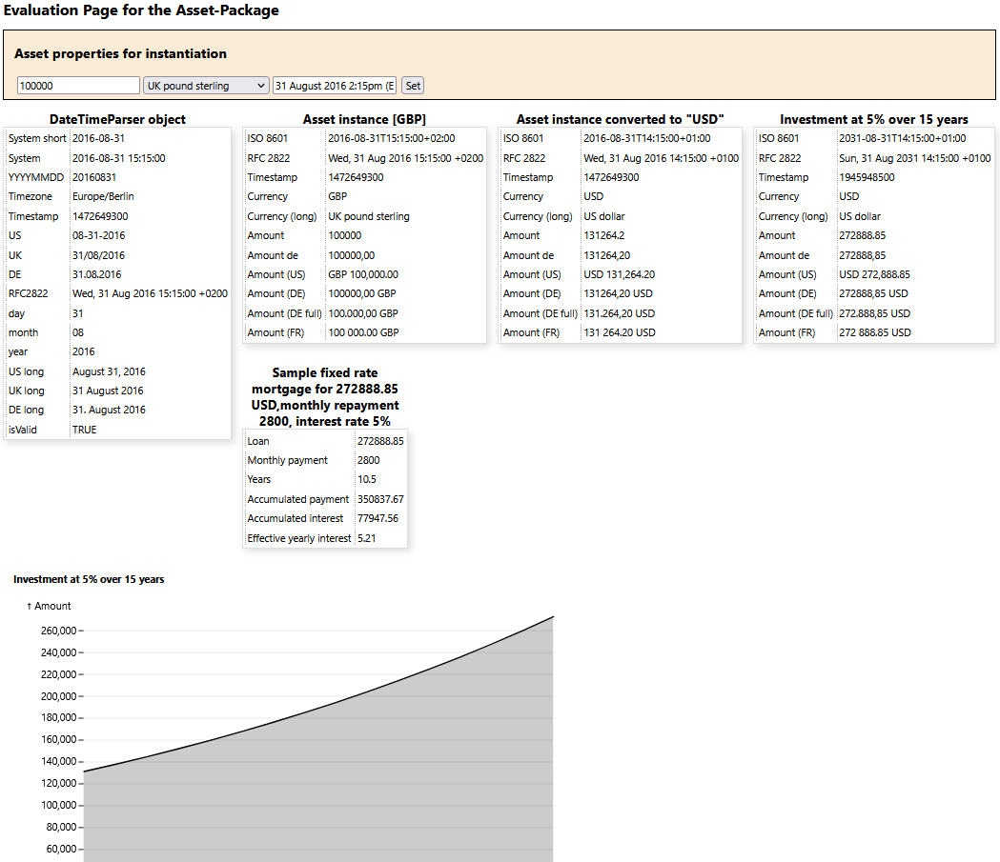

# Asset package

The asset class of this package is used to create objects representing an asset. The main properties of an asset are "value", "unit" and "dateTime", e.g. 1 (value) Euro (unit) at 12/03/2023. These three properties need to be provided to the contructor of a new asset object. When a diffenrent unit is set, the exchangerate at the asset objects dateTime will be applied. 

>[!NOTE]
>European Central Bank exhchage rates are used. If an exchage rate is not yet present as csv-file in the data directory, it will be downloaded via the ECB API and saved to data directory. If an exchange rate is requested for a weekend (such as in the code sample below) or bank holiday, the latest valid exchange rate before that date will be used and a warning will be added as asset property.

## Code Sample


```
require_once('../php/Rates.php');
require_once('../php/Asset.php');

// asset object creation
$asset = new \SourcePot\Asset\Asset(1234.56,'JPY',new \DateTime("2015-08-23"));

// setting a new unit
$asset->setUnit("USD");

// echo asset will show 10.06 USD (2015-08-21T23:00:00+01:00)
echo $asset; 

// craeting an array from asset
$assetArr = $asset->getArray("USD");

/*  The array content is: 
object {11}
ISO 8601:           2015-08-21T23:00:00+01:00
RFC 2822:           Fri, 21 Aug 2015 23:00:00 +0100
Timestamp:          1440194400
Currency:           USD
Amount:             10.06
Amount de:          10,06
Amount (US):        USD 10.06
Amount (DE):        10,06 USD
Amount (DE full):   10,06 USD
Amount (FR):        10.06 USD
Warning:            W001: "USD" rate for "2015-08-22" missing, rate dated "2015-08-21" used.
*/
```

## Evaluation web page

An evaluation web page is provided with this package. The webpage allows:
1. flexible creation of an asset object, 
2. asset conversion to US-Dollars and 
3. adding yearly interest.

